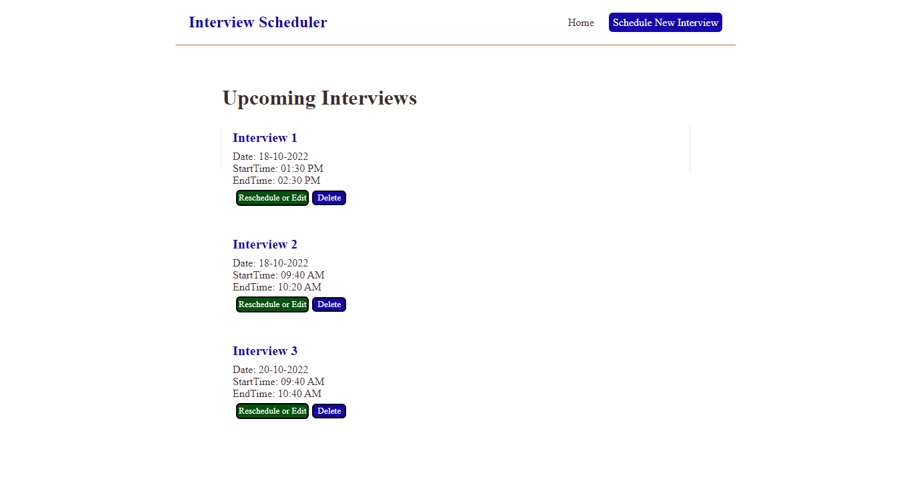
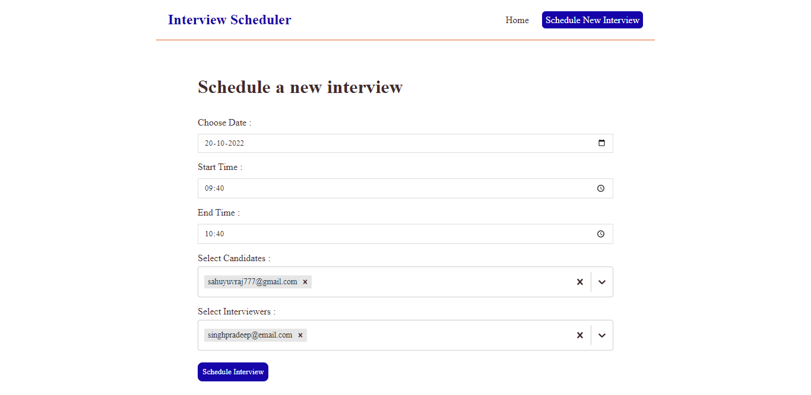
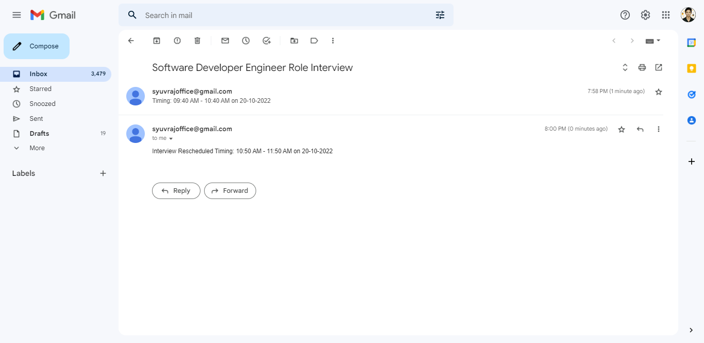
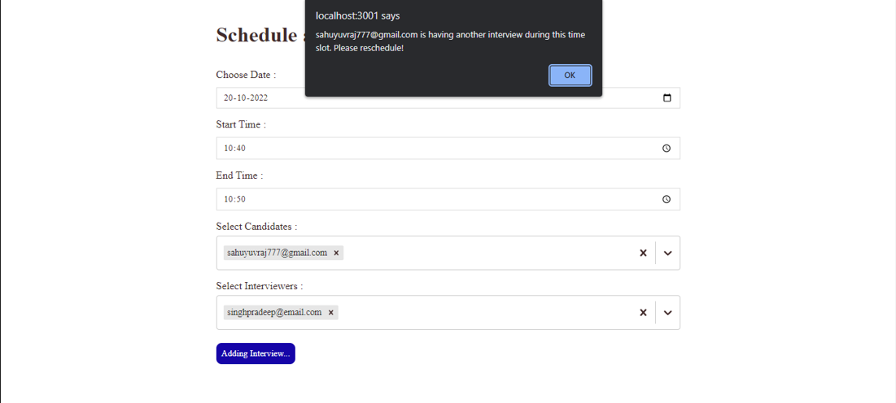

# Interview Scheduler

A Web application where admins can create interviews by selecting participants, interview start time and end time

## Overview

- An interview creation page where the admin can create an interview by selecting participants, start time and end time.
- Backend throws an error with proper error message if:
  -> Any of the participants is not available during the scheduled time (i.e, has another interview scheduled)
  -> No of participants is less than 2.
- An interviews list page where admin can see all the upcoming interviews.
- Without a page like create Users/Participants. Created them directly in the database.

## How to build and run this project

#Backend

- Execute `npm install`
- Make sure MySQL is installed your system.
- Login to MySQL using your root user.
- Execute the following MySQL Queries:
  - `CREATE USER 'username'@'localhost' IDENTIFIED WITH mysql_native_password BY 'password';`
  - `GRANT ALL PRIVILEGES ON DB_NAME.* TO 'username'@'localhost';`
  - `FLUSH PRIVILEGES;`
  - `exit`
- Rename the following files:
  - .env.example --> .env
  - ormconfig.json.example --> ormconfig.json
- Provide `username`, `password` and `database` (DB_NAME) info in **ormconfig.json** for typeorm to properly connect to the Database.
- Provide `NODE_ENV` (dev/prod), `PORT`, `EMAIL`, `PASSWORD` in **.env** file
- Execute `npm start`.

## Project Directory Structure

```
.
.
├── src
│   ├── controllers
│   │   └── v1
│   │       ├── interview
│   │       │   └── interviews.ts
│   │       └── participant
│   │           └── participants.ts
│   ├── core
│   │   ├── ApiError.ts
│   │   └── ApiResponse.ts
│   ├── database
│   │   ├── model
│   │   │   ├── BaseModel.ts
│   │   │   ├── Interview.ts
│   │   │   └── Participant.ts
│   │   ├── repository
│   │   │   ├── InterviewRepo.ts
│   │   │   └── ParticipantRepo.ts
│   │   └── db.ts
│   ├── routes
│   │   └── v1
│   │       ├── interview
│   │       │   └── interviews.ts
│   │       ├── participant
│   │       │   └── participants.ts
│   │       └── router.ts
│   ├── utils
│   │   ├── asyncHandler.ts
│   │   ├── checkOverlap.ts
│   │   └── seeder.ts
│   ├── app.ts
│   ├── config.ts
│   └── server.ts
├── LICENSE
├── ormconfig.json
├── ormconfig.json.example
├── package.json
├── package-lock.json
├── README.md
└── tsconfig.json

14 directories, 26 files

```

##Frontend

- Execute `npm install`
- Make sure backend is running.
- Execute `npm start`.
- App will start running at `http://localhost:3001/`

<br>
NOTE: We can change the API_URL and PORT from src/config/config.js

# Project screenshot

## Scheduler Page



## Form



## Rescheduling


## Id


## Mail



## Alert


